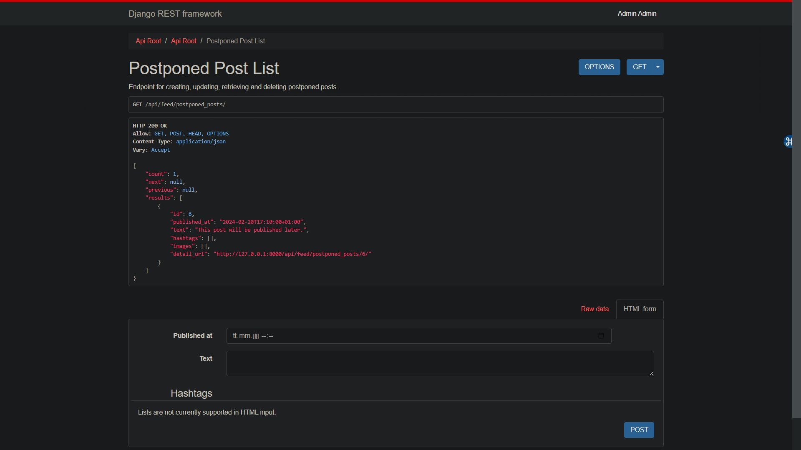

# Social Media API

API for publishing posts and reactions to them written in DRF.

## Table of Contents

- [Features](#features)
- [Technologies Used](#technologies-used)
- [Getting Started](#getting-started)
  - [Prerequisites](#prerequisites)
  - [Installation](#installation)
- [API Documentation](#api-documentation)
- [DB Structure](#db-structure)
- [Screenshots](#screenshots)
- [Contributing](#contributing)

## Features

- Publish posts and add comments to them.
- Schedule post publishing.
- Add multiple images to the posts.
- Follow and unfollow other users.
- View list of posts published by all the users you follow.
- Filter posts by hashtags.
- Like and unlike posts.
- Retrieve list of posts that you've liked.
- User authentication and authorization.
- Throttle API requests to prevent abuse.

## Technologies Used
* Django
* Django REST framework
* Docker
* Swagger/OpenAPI Documentation
* Celery

## Getting Started

### Prerequisites
* Python (version 3.10 or higher)
* Git (optional, for cloning the repository)
* Docker

### How to run:
1. Install Docker:
If you don't have Docker installed, you can download and install it from the official Docker website: https://docs.docker.com/get-docker/

2. Clone the repository:
   ```bash
   git clone https://github.com/vkrasnovyd/social-media-api.git
   cd social-media-api
   ```
3. Copy .env.sample -> .env and populate with all required data
4. Start the Docker containers:
   ``` bash 
   docker-compose up --build
   ```
## API Documentation
The API documentation can be accessed at http://localhost:8000/api/doc/swagger/ which provides an interactive interface to explore and test the available API endpoints.

## DB structure


## Screenshots





## Contributing
I welcome contributions to improve the Social Media API Service. Feel free to submit bug reports, feature requests, or pull requests to `v.krasnovyd@gmail.com`
